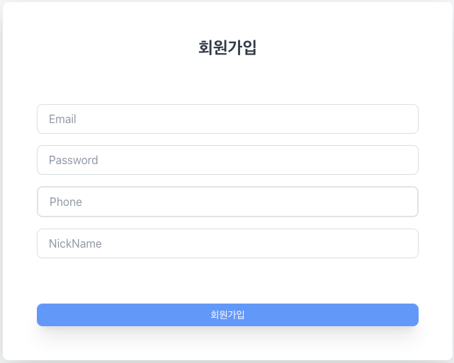
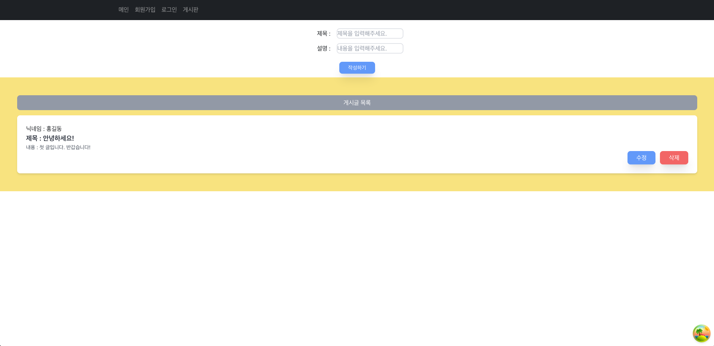

# 프론트 게시판 구현하기

## FrontEnd - 심재두

## #프로젝트 소개
- 회원가입/ 로그인/ 게시글 작성이 있는 웹페이지입니다.
- 로그인을 할 경우 로컬스토리지 대신 쿠키에 유저의 토큰값을 담습니다.
- 서버단에서는 목적성에 맞게 가드를 설정하였고 기본적인 CRUD를 구현하였습니다.
- 게시글 작성시 로그인을 했을 때의 토큰값이 필요하고 토큰이 없을 경우 작성을 하지 못합니다.
- 각 게시글별 멤버 아이디를 통해 토큰과 비교를 하여 본인 게시글 수정 / 삭제도 가능하게 합니다.

###  회원가입

### 로그인

### 게시판


### Main Server Use

```bash
npm start
```

### Install
```angular2html
npm i | npm install
```